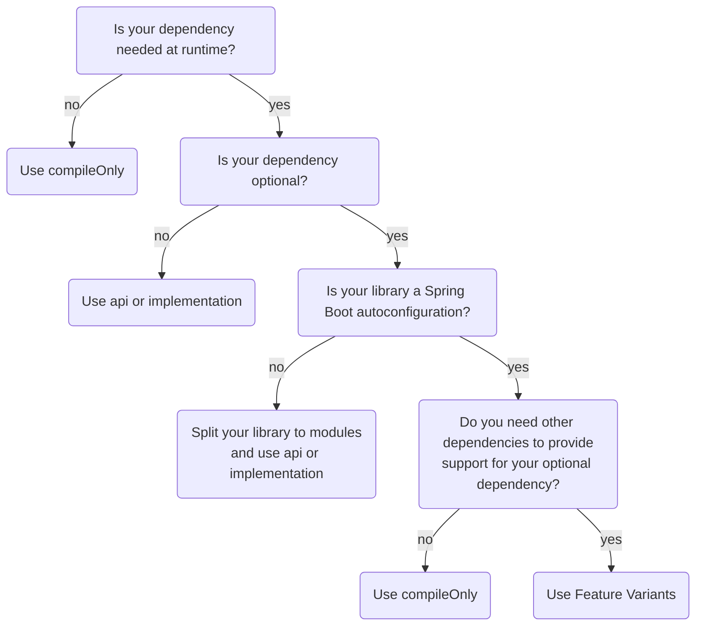

Many developers might not pay much attention to the `compileOnly` scope, but you've probably encountered it at some point. Have you ever wondered about its functionality and where it fits best?
<!--more--> 

The `compileOnly` configuration was introduced in Gradle 2.12 (2016) as one of the most anticipated features. According to the original [Gradle blog post](https://blog.gradle.org/introducing-compile-only-dependencies):

> Compile-only dependencies address a number of use cases, including:
> * Dependencies required at compile time but never required at runtime, such as source-only annotations or annotation processors;
> * Dependencies required at compile time but required at runtime only when using certain features, a.k.a. optional dependencies;
> * Dependencies whose API is required at compile time but whose implementation is to be provided by a consuming library, application or runtime environment.

We'll delve into these use cases shortly. You can use the following decision tree as an entry point and read the appropriate section to get more details.



## How it works?

Let's start by understanding how `compileOnly` actually works.

When you publish your library to Maven Central, Gradle generates two metadata files for you:
* `my-library-1.0.0.pom`
* `my-library-1.0.0.module`

The `pom` file is for Maven interoperability, while the `module` file contains additional Gradle metadata, commonly referred to as Gradle Module Metadata (GMM). If your library is consumed by another Gradle build, the GMM is used to benefit from Gradle exclusive features like Feature Variants, which are not available in Maven.

Consider the following example in your buildscript:

```kotlin {title="build.gradle.kts", hl_lines="2,3,4" annotations="1,2,3"}
dependencies {
    api("org.example:blue-library:1.0.0")
    implementation("org.example:red-library:1.0.0")
    compileOnly("org.example:green-library:1.0.0")
}
```

Publishing it to the local Maven repository:
```
./gradlew publishToMavenLocal
```

Generates the following files:
```xml {title="my-library-1.0.0.pom", hl_lines="7-10,13-16", annotations="4,5"}
<project>
    <groupId>org.example</groupId>
    <artifactId>my-library</artifactId>
    <version>1.0.0</version>
    <dependencies>
        <dependency>
            <groupId>org.example</groupId>
            <artifactId>blue-library</artifactId>
            <version>1.0.0</version>
            <scope>compile</scope>
        </dependency>
        <dependency>
            <groupId>org.example</groupId>
            <artifactId>red-library</artifactId>
            <version>1.0.0</version>
            <scope>runtime</scope>
        </dependency>
    </dependencies>
</project>
```

```json {title="my-library-1.0.0.module", hl_lines="12-16,24-28", annotations="6,7"}
{
  "component": {
    "group": "com.example",
    "module": "example-library",
    "version": "2.0.0-SNAPSHOT"
  },
  "variants": [
    {
      "name": "apiElements",
      "dependencies": [
        {
          "group": "org.example",
          "module": "blue-library",
          "version": {
            "requires": "1.0.0"
          }
        }
      ]
    },
    {
      "name": "runtimeElements",
      "dependencies": [
        {
          "group": "org.example",
          "module": "red-library",
          "version": {
            "requires": "1.0.0"
          }
        }
      ]
    }
  ]
}
```

The `api` dependency  is translated to Maven `compile` scope  and to a dependency of Gradle `apiElements` variant . 

The `implementation` dependency  is translated to Maven `runtime` scope  and to a dependency of Gradle `runtimeElements` variant .

It can be suprising, but the `compileOnly` dependency  is omitted in both `pom` file and the GMM. It means that this dependency is not transitive and won't be visible in the client classpaths.

Having this basic understanding, let’s explore the use cases mentioned in the original blog post.

## Pure compile-time dependencies

> Dependencies required at compile time but never required at runtime, such as source-only annotations or annotation processors

I completely agree with that. In situations where the dependency is never needed at runtime, use `compileOnly`. 

For example:
* you use only annotations or annotation processors from the dependency
* you want to pass a type-safe reference for a class to some annotation, like `@ConditionalOnClass(OkHttpClient.class)`

Using `compileOnly` here prevents unnecessary transitive dependencies at the client side, simplifying dependency management.

## Optional dependencies

> Dependencies required at compile time but required at runtime only when using certain features, a.k.a. optional dependencies

I basically agree with this bullet point, although there is more to this topic.

Imagine you develop a library providing some functionality for HTTP clients. You want to support multiple HTTP clients, like `RestTemplate`, `Feign`, `Ktor`, etc. How would you model it?

### Option 1: Multiple modules

You can create different modules dedicated to each client, like `my-library-rest-template`, `my-library-feign`, and `my-library-ktor`. Each module will carry its own transitive dependency to the corresponding HTTP client. Users of your library are likely to find this approach intuitive and easy to understand. As a result, this method is often the preferred choice.

### Option 2: Single module

In certain cases, it may be more effective to have one module capable of handling multiple optional dependencies. A fitting example is when you're developing a Spring Boot starter. Typically, you will have an autoconfiguration with some conditional beans, created only when a particular dependency is present.

To achieve this, set your optional dependencies as `compileOnly`. The users of your library may choose to provide these dependencies or not. Your job is to ensure that `NoClassDefFoundError` is not thrown, even if the optional dependency is missing. If you work with Spring, the `@ConditionalOnClass` annotation will be your best friend. Outside of Spring, you can use the good old `try..catch` block. For example:
```kotlin
fun configureKtorClient(): io.ktor.HttpClient? =
    if (isOnClasspath { io.ktor.HttpClient::class }) {
        // build and configure HttpClient...
    } else {
        null
    }

private fun isOnClasspath(clazz: () -> KClass<*>): Boolean =
    try {
        clazz()
        true
    } catch (e: NoClassDefFoundError) {
        false
    }
```

The above code will simply return `null` if the Ktor dependency is missing

### Conditional dependencies

Let's complicate our previous example a little. Assume that our implementation providing the Ktor support needs additional dependency for Jackson. The key thing is that Jackson **is needed only when the client wants to use Ktor support**. We can say that it's a _conditional dependency_.    

```kotlin {title="Library -> build.gradle.kts"}
dependencies {
    compileOnly("io.ktor:ktor-client-core-jvm:2.3.7")
    compileOnly("com.fasterxml.jackson.core:jackson-core:2.16.1")
}
```

Now, let's say that some client uses our library, and he correctly provides the optional Ktor dependency:
```kotlin {title="Client -> build.gradle.kts"}
dependencies {
    implementation("dev.panuszewski:http-clients-library:1.0.0")
    implementation("io.ktor:ktor-client-core-jvm:2.3.7")
}
```

This client will most likely get the `NoClassDefFoundError` when trying to use our Ktor support. Even though he provided the Ktor dependency, there are still Jackson classes missing.

The conditional dependencies can be tricky. **If you have this kind of situation, I highly recommend to split your library into feature modules**, as described in .

However, if having multiple modules is not an option for you, there is another way. Let me introduce a little-known Gradle feature called _Feature Variants_. It basically allows you to define various optional _features_ which your library provides. For example, the Ktor support could be declared as a feature:  

```kotlin {title="Library -> buildSrc/src/conventionPlugin.gradle.kts"}
// we put this code in the conventionPlugin.gradle.kts 
// instead of directly in build.gradle.kts to get the 
// typesafe accessors like 'ktorImplementation' 
java {
    registerFeature("ktor") {
        usingSourceSet(sourceSets["main"])
    }
}
```

It gives you the opportunity to declare dependencies which are only resolved when a particular feature is requested by the client. In our case it would be:
```kotlin {title="Library -> build.gradle.kts"}
plugins {
    conventionPlugin
}

dependencies {
    ktorImplementation("io.ktor:ktor-client-core-jvm:2.3.7")
    ktorImplementation("com.fasterxml.jackson.core:jackson-core:2.16.1")
}
```

The client now needs to explicitly require the Ktor feature (in Gradle terms: _capability_). It can be done like this:

```kotlin {title="Client -> build.gradle.kts"}
dependencies {
    implementation("dev.panuszewski:library-a:1.0.0") {
        capabilities {
            requireCapability("dev.panuszewski:library-a-ktor")
        }
    }
}
```

What's nice about this approach is that the **client will automatically get all dependencies required for the Ktor support to work properly.** Not so nice is the verbose syntax which most of the Gradle users are not very familiar with.

While you may like it or not, Feature Variants are a viable option to solve the problem of conditional dependencies in a single-module library.

## Provided dependencies

> Dependencies whose API is required at compile time but whose implementation is to be provided by a consuming library, application or runtime environment.

Spoiler: I totally don't agree.

Developers from the Maven world tend to see `compileOnly` as Gradle's equivalent of the `provided` scope, but there are differences. The `compileOnly` dependencies aren't visible in test classpaths, unlike those defined in Maven `provided` scope.

If (for some reason) you need the `provided` scope equivalent, either:
* put the dependency in both `compileOnly` and `testImplementation` configurations, or
* apply the `war` plugin and put the dependency in `providedCompile` configuration

Apart from the Maven analogy, let's analyze how provided dependencies fit into the modern software development.

### Application development

The provided dependencies only make sense if you deploy your application in a application server (e.g. GlassFish or JBoss). **It's not a common approach in a modern software**, though. Typically, your app starts up with an embedded web server, so you have to package your application together with all the runtime dependencies. It makes the `compileOnly` unsuitable.

### Library development

Not only the application server can provide dependencies. If we develop a library, we can think of the client classpath as our deployment environment, and require it to provide components we depend on.

For example, let's say we develop some utility for Spring Webflux. It basically doesn't make sense to use it without the Webflux itself, so we define it as `compileOnly` dependency:
```kotlin
compileOnly("org.springframework:spring-webflux:6.1.2")
```
It makes the library consumers responsible for providing it at runtime. Otherwise, they will most likely get `NoClassDefFoundError`. It's not the most gentle way of informing our clients that they are missing a dependency to Webflux, isn't it? Simply making Webflux a transitive dependency (by replacing `compileOnly` with `api` or `implementation`) would eliminate those exceptions, making our library work seamlessly.

 Thus, it is advisable to refrain from using `compileOnly` to specify a library's provided dependencies. While the intention may be to reduce the number of transitive dependencies, ultimately, **users will either need to supply the missing dependency themselves or encounter a runtime error**. It is more effective to ensure everything works by default.