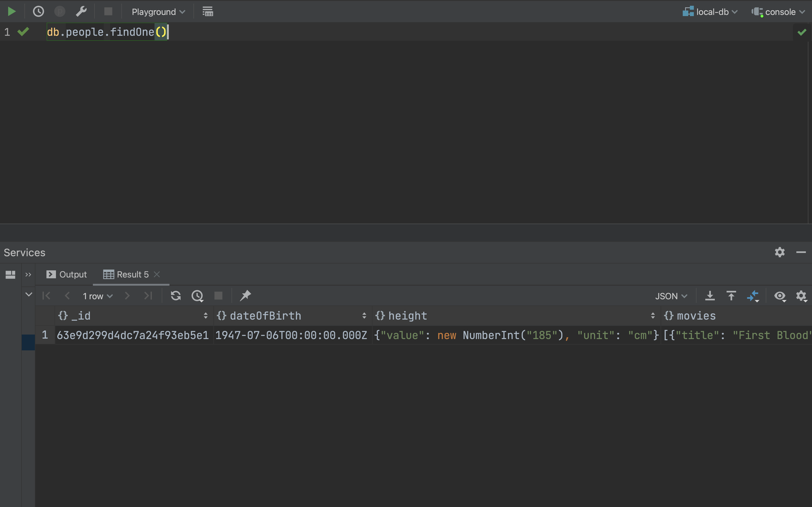
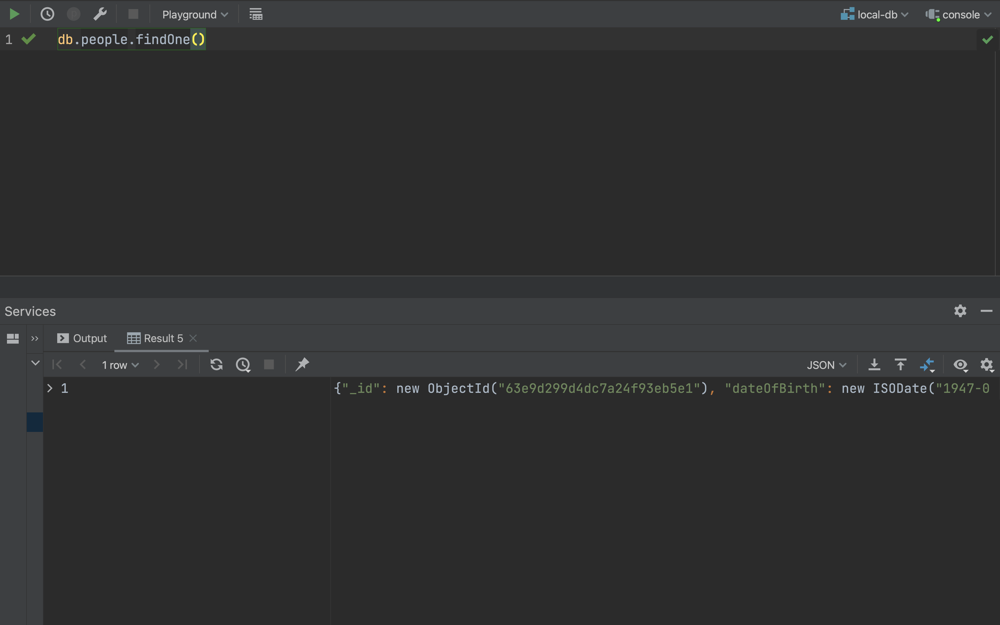
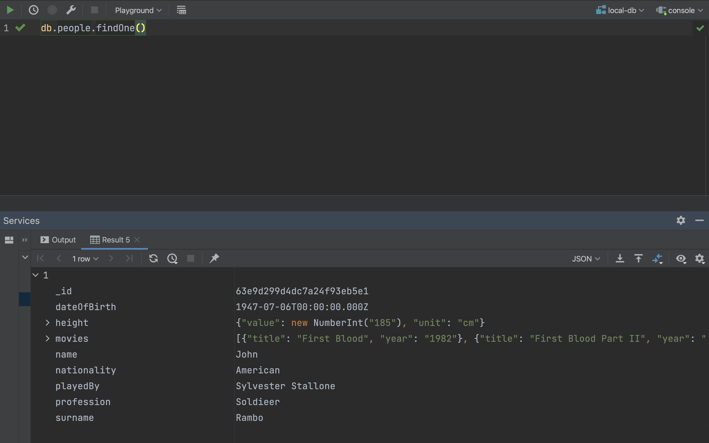
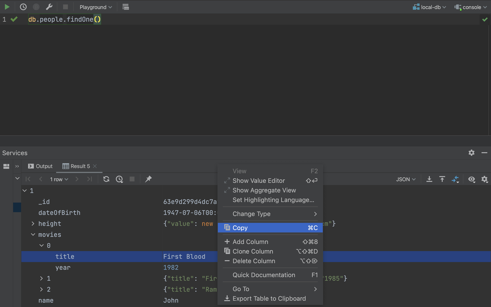
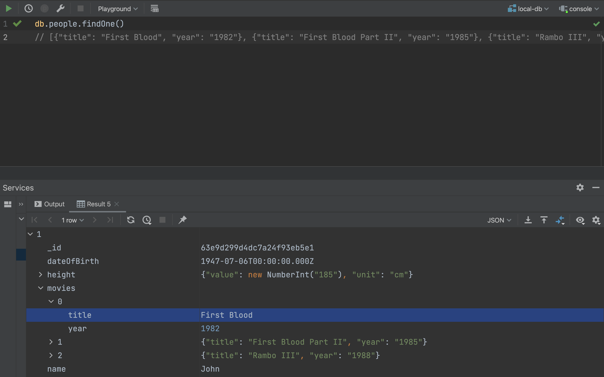

If you use DataGrip to explore the contents of MongoDB databases, you may have encountered several issues with the interface. And if you don’t like to click too much (like me), those issues may have driven you mad already 😵
<!--more-->

Let’s say you have a collection of movie characters, and you want to view a single document. We can execute a simple `db.people.findOne()` and see the result:

Not really what you’ve expected, huh?

The default presentation mode for query results in DataGrip is `Table`, and it works really well for relational databases. Unfortunately, in case of document databases, with many nested fields and lists, it does not provide the best user experience.

Let’s try to make it more convenient for us. Go and select the option `View as | Tree`:

Ok, we have the Tree view, but still we need one more click to have the tree expanded:

Now it looks nice, we can explore the document as a tree. Let’s not waste any more time and find out what was the first Rambo movie and copy its title:

Now paste it…

Crap! Not really what you’ve expected, huh?

We wanted just the string "First Blood", but DataGrip was generous enough to provide us the JSON with full contents of the `movies` field.

To sum up, what problems have we experienced?
* the default presentation mode is `Table` and there’s no way to change that default to `Tree`
* when we get the single result in `Tree` mode, we would like it to be automatically expanded, but it isn’t
* the `Copy` action (`⌘C`) gives us the full JSON instead of just the leaf value

Those issues made me mad enough to write my own plugin which can fix them.

Here it is:

 

-> [JetBrains Marketplace](https://plugins.jetbrains.com/plugin/20941-tree-view-by-default)

-> [GitHub](https://github.com/radoslaw-panuszewski/tree-view-by-default)

What it does?

* Changes default presentation mode of the query results to `Tree`
* If there is only one result, it is automatically expanded
* You can copy value of the leaf node without the containing JSON via `⌘⌥C` (there is new action named `Copy Leaf Value` and you can give it any keyboard shortcut you like)

You can install it directly from your DataGrip via searching for plugin Tree View By Default. Just make sure you have DataGrip in version `2022.3` or newer. I will keep the plugin compatible with all the upcoming versions since `2022.3`.

If it happens to make your life a little easier, don’t hesitate to throw a ★ on the GitHub repo and rate the plugin on the JetBrains marketplace 😉
